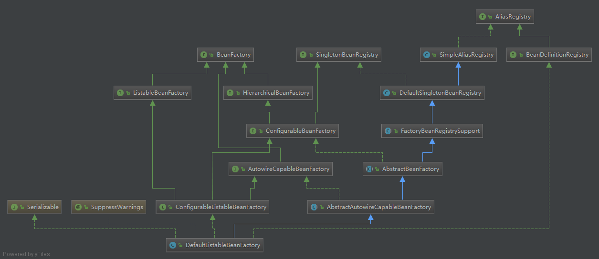
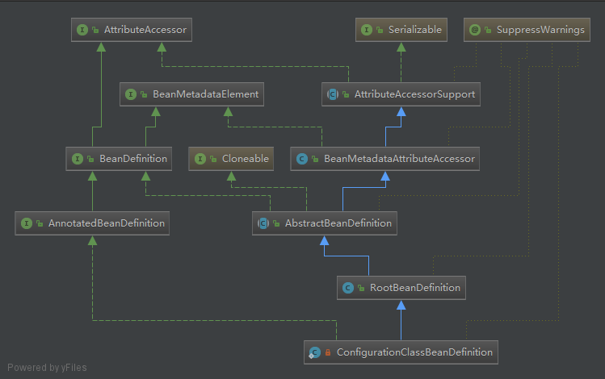

# Spring Beans

## BeanFactory
BeanFactory有三个子类ListableBeanFactory、HierarchicalBeanFactory
和AutowireCapableBeanFactory。它们的最终默认实现类是DefaultListableBeanFactory。
ListableBeanFactory表示这些Bean是可列表的，
HierarchicalBeanFactory表示这些Bean是有继承关系的，
也就是每个Bean有可能有父Bean。
AutowireCapableBeanFactory接口定义Bean自动装配的规则。
这四个接口共同定义Bean的集合、Bean之间的关系以及Bean的行为。

在BeanFactory只对IOC容器进行了最基本的定义，要知道工厂如何生产对象，
需要看IOC的具体实现。比如XmlBeanFactory，ClassPathXmlApplicationContext等。
XmlBeanFactory是最基本的IOC实现，可以读取XML文件中BeanDefinition。

ApplicationContext是Spring中提供的一个高级的IOC容器，除了提供IOC容器的
基本服务外，还提供以下附加服务：
    
    1.支持信息源，可以实现国际化。（实现MessageSource接口）
    2.访问资源。（实现ResoucePatternResolver接口）
    3.支持应用事件。（实现ApplicantionEnventPublisher接口）

##BeanDefinition
IOC中管理各种Bean对象及其相互关系，Bean对象在Spring中是以BeanDefinition
来进行描述的。

