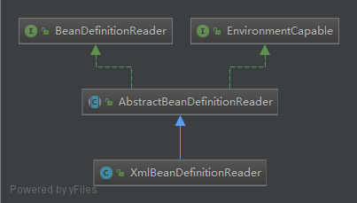

# Spring Beans

## BeanFactory
BeanFactory有三个子类ListableBeanFactory、HierarchicalBeanFactory
和AutowireCapableBeanFactory。它们的最终默认实现类是DefaultListableBeanFactory。
ListableBeanFactory表示这些Bean是可列表的，
HierarchicalBeanFactory表示这些Bean是有继承关系的，
也就是每个Bean有可能有父Bean。
AutowireCapableBeanFactory接口定义Bean自动装配的规则。
这四个接口共同定义Bean的集合、Bean之间的关系以及Bean的行为。

在BeanFactory只对IOC容器进行了最基本的定义，要知道工厂如何生产对象，
需要看IOC的具体实现。比如XmlBeanFactory，ClassPathXmlApplicationContext等。
XmlBeanFactory是最基本的IOC实现，可以读取XML文件中BeanDefinition。

ApplicationContext是Spring中提供的一个高级的IOC容器，除了提供IOC容器的
基本服务外，还提供以下附加服务：
    
    1.支持信息源，可以实现国际化。（实现MessageSource接口）
    2.访问资源。（实现ResoucePatternResolver接口）
    3.支持应用事件。（实现ApplicantionEnventPublisher接口）

##BeanDefinition
IOC中管理各种Bean对象及其相互关系，Bean对象在Spring中是以BeanDefinition
来进行描述的。

Bean的解析过程比较复杂。Bean的解析通过对Spring配置文件的解析。

##IOC容器的初始化
IOC容器的初始化包括BeanDefinition的Resource**定位、载入、注册**这三个基本的过程。
ApplicationContext允许上下文嵌套，通过保持父上下文维持一个上下文体系。对于Bean的
查找可以在这个上下文体系中发生，首先检查当前上下文，其次是父上下文，逐级向上，
这样为不同的Spring应用提供了一个共享的Bean定义环境。

##IOC容器的依赖注入
当IOC完成Bean的定位载入注册后，IOC已经管理了Bean的相关数据，但是此时还没有对Bean
进行依赖注入，DI会发生在以下两种情况：
    
    1. 用户第一次通过getBean方式向IOC容器搜索Bean时，会发生依赖注入。
    2. 当用户在Bean定义中，声明了lazy-init标识。即让容器在解析注册时，进行预实例化，
    会触发依赖注入。
    